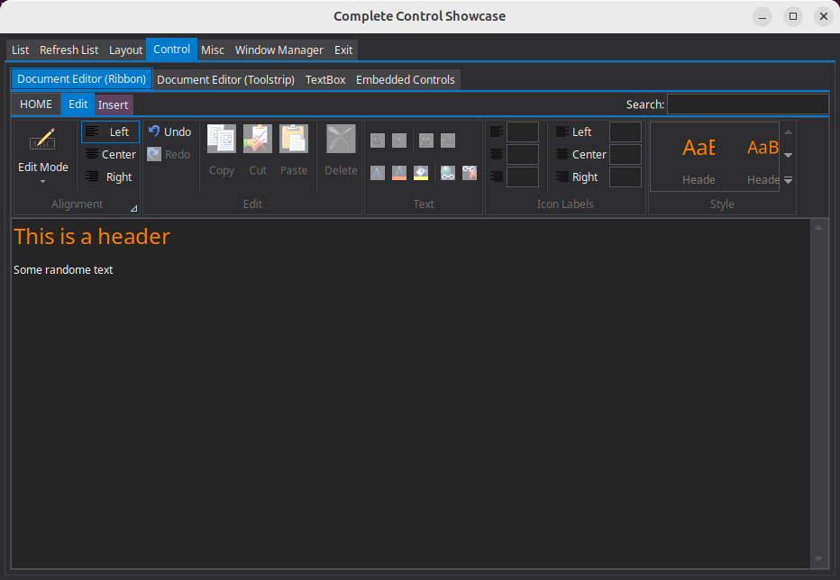

# wGac — Wayland Port of GacUI

[中文版](README_CN.md)

wGac implements the native GacUI platform layer for Linux Wayland using Wayland, Cairo, Pango, and XKBCommon.

## Prerequisites

The committed `Import/` and `Apps/` snapshots make a normal build independent of sibling source repositories. On Ubuntu, install the system build dependencies once with:

```bash
sudo ./build-prerequisites-ubuntu.sh
```

The script requires root privileges but never invokes `sudo` itself. It uses `apt-get` to update apt metadata and install the compiler, CMake, `pkg-config`, the required development packages, and the libdecor GTK runtime plugin. Review the script before running it if you need to audit system changes. On Debian or another Linux distribution, install the equivalent packages with that distribution's package manager.

The retained `WGacDialogService` implementation uses GIO, but current Wayland applications select `FakeDialogService` and do not require a desktop portal backend.

`./build.sh` only configures and builds the project; it never downloads or installs dependencies. If CMake reports a missing compiler, `pkg-config`, or development module on Ubuntu, run `sudo ./build-prerequisites-ubuntu.sh` and then retry `./build.sh`.

Run applications from a Wayland desktop session with `WAYLAND_DISPLAY` and `XDG_RUNTIME_DIR` available.

wGac requires libdecor and a real runtime decoration plugin at startup; it stops with a diagnostic instead of silently accepting libdecor's undecorated fallback. To make repeated switches between GacUI custom frames and platform frames safe on every compositor, wGac forces libdecor to provide its client-side platform frame even when server-side decorations are available. This libdecor frame is the native platform frame from GacUI's perspective and is distinct from GacUI's custom window template.

For maintenance work, keep the GacUI, Workflow, and Tools repositories beside wGac, or run `./syncOrg.sh`. `import.sh` reads GacUI framework snapshots, and `syncProj.sh` reads GacUI test resources and builds the Workflow and GacUI generators. The sibling Release repository is not a build or import dependency.

## Supported Platforms

- Windows implementation is released in [the Release repo](https://github.com/vczh-libraries/Release)
- Linux implementation is released in [the wGac repo](https://github.com/vczh-libraries/wGac)
- macOS implementation is released in [the iGac repo](https://github.com/vczh-libraries/iGac)
- HTML5 implementation is released in [the GacJS repo](https://github.com/vczh-libraries/GacJS)



.png)

## Project Structure

```text
wGac/
├── WGac/                              Wayland platform implementation
│   ├── Protocol/                      Committed Wayland protocol sources
│   ├── Renderers/                     Cairo/Pango GacUI renderer
│   ├── Services/                      Native platform and automation services
│   └── Wayland/                       Display, seat, and buffer integration
├── WGacShared/                        GacUI, wGac, and shared test libraries
├── WGacTest/                          Hello World app and native service tests
├── WGacFullControlTest/               Full Control Test, standard or hosted
├── WGacTuiControlTest/                Terminal Control Showcase using TuiSkin
├── WGacCppTestRvm/                    Remote View Model Test client
├── RemotingTest_Rendering_Wayland/    Native renderer for RemotingTest_Core
├── Apps/                              Synchronized resources and generated C++
├── Import/                            Imported GacUI amalgamated sources
├── Import-Test/                       Test-only GacUI remoting helper amalgamations
├── import.sh                          Refresh Import from sibling GacUI
├── syncProj.sh                        Refresh and generate Apps and shared sources
├── syncOrg.sh                         Synchronize organization repositories, including wGac
├── build-prerequisites-ubuntu.sh      Install Ubuntu system build dependencies
├── build.sh                           Build all test targets
├── test.sh                            Launch one native test target
└── test_core.sh                       Full-build and launch a sibling GacUI Core-side target
```

`Import/` and `Import-Test/` are frozen after `./import.sh`; framework fixes belong in GacUI, and Wayland compatibility fixes belong in wGac. `Import-Test/` contains the dedicated neutral `Test.RemotingHelpers` pair; the stdio transport implementation comes from the matching `VlppOS.Linux.cpp` in `Import/`. These files are for platform test targets and are not part of the ordinary GacUI framework snapshot. Files under `Apps/*/Resources/` and `Apps/*/Source/` are synchronized or generated by `./syncProj.sh` and must not be edited directly.

## Synchronizing Dependencies

Synchronize the organization repositories, including this wGac checkout:

```bash
./syncOrg.sh
```

Refresh the imported framework snapshot:

```bash
./import.sh
```

This replaces `Import/` and `Import-Test/`, copies the ordinary framework files from `../GacUI/Import/` and `../GacUI/Release/`, adds the DarkSkin and TuiSkin release sources, moves the neutral `Test.RemotingHelpers` pair into `Import-Test/`, and marks both snapshots read-only. The imported `VlppOS.Linux.cpp` supplies the stdio transport implementation.

Refresh the Terminal Control Showcase, Full Control Test, Remote Protocol Test, and Remote View Model Test projects:

```bash
./syncProj.sh
```

This incrementally builds Workflow's `CppMerge` and GacUI's `GacGen`, copies all four upstream resource trees, preserves resource-owned seed C++ files, and regenerates their x64 C++ sources under `Apps/`. It also copies the shared TUI GuiMain from `CppTest_Tui/Main.cpp` and refreshes the shared native-renderer and RVM entry points, the RVM initializer, and the shared FullControlTest palette handler. The standalone showcase attaches that handler so palette changes refresh existing controls in both standard and hosted modes. MiniHTTP automation is part of the imported GacUI snapshot, while reusable remoting test helpers come from `Import-Test/`; neither is maintained as a local `WGacShared/Mini*.cpp` copy.

## Building

```bash
./build.sh
./build.sh --rebuild
```

The first command is incremental. `--rebuild` removes only the `build/` directory and performs a clean build. Dependency discovery remains in CMake; when an Ubuntu machine is missing the required system packages, run `sudo ./build-prerequisites-ubuntu.sh` once and retry the build.

The root CMake project uses C++23 and builds:

- `GacUI`, the imported GacUI framework.
- `WGac`, the Wayland platform layer.
- `WGacShared`, imported remoting test helpers shared by the test targets.
- `Test_HellWorld_Cpp`.
- `Test_FullControlTest`.
- `Test_CppTest_Rvm`.
- `WGacTui` and `Test_TuiControlTest`.
- `RemotingTest_Rendering_Wayland`.

Run the native async-service regressions after building:

```bash
./build/WGacTest/bin/Test_AsyncService /C
```

These tests cover pending work during nested modal pumping and cancellation when a callback stops the service.

## Running and Automation

```bash
./test.sh --app:tui
./test.sh --app:simple
./test.sh --app:simple --unblock
./test.sh --app:fct
./test.sh --app:fct --hosted
./test.sh --app:fct --hosted --unblock
./test.sh --app:rvmt
./test.sh --app:rvmt --unblock
./test.sh --app:renderer
./test.sh --app:renderer --port:8890
./test.sh --app:renderer --unblock
./test_core.sh --app:cpptest_rvm --protocol:minihttp --unblock
./test_core.sh --app:fct --protocol:minihttp
./test_core.sh --app:rpt --protocol:minihttp
./test_core.sh --app:rvmt --protocol:minihttp [--cli]
```

`--hosted` is valid only with `--app:fct`. `--port:<1-65535>` is valid only with `--app:renderer` and selects that renderer's automation listener; it does not change the `/MiniHttp` connection to Core on port 8888. The default renderer automation port is 8889. `--unblock` starts the selected executable in the background and prints its PID.

`test_core.sh` follows the same `--app:` and `--unblock` spelling and requires
`--protocol:minihttp`, the only portable transport. It calls GacUI's
`Test/Linux` build helper with `-f` before starting each used GacUI project.
For manual `cpptest_rvm` and `rvmt` modes it starts the requester/Core first,
waits one second, then full-builds and starts `RemotingTest_RvmHost`; an
unblocked manual run prints both PIDs. `--cli` is supported by `--app:rvmt`,
prebuilds the host, and lets Core auto-launch it over stdio. Portable
`Test_CppTest_Rvm` remains manual `/MiniHttp` only.

The normal applications expose MiniHTTP automation on port 8888:

- Hello World: `/Automation/Test_HellWorld_Cpp`
- Full Control Test: `/Automation/Test_FullControlTest`
- Remote View Model Test: `/Automation/CppTest_Rvm`

For example:

```bash
curl http://localhost:8888/Automation/Test_HellWorld_Cpp/Controls
curl -H 'Content-Type: application/json; charset=utf8' \
    --data '!Exit' \
    http://localhost:8888/Automation/Test_HellWorld_Cpp/IO
```

Use `GET .../Controls` to inspect the control tree and `POST .../IO` or `POST .../IO/<windowId>` to send an IO command. A successful command returns `Queued`.

Always stop background test processes when verification is complete.

`--app:rvmt` waits for the matching Workflow RPC host. Start the client first, then run:

```bash
../GacUI/Test/Linux/RemotingTest_RvmHost/Bin/RemotingTest_RvmHost /MiniHttp
```

## Terminal Control Showcase

`./test.sh --app:tui` runs the hosted GacUI showcase directly in the current terminal. It requires interactive stdin/stdout and runs in the foreground; `--unblock`, `--hosted`, and `--port` are rejected. It has no HTTP automation endpoint. Start at 120x40 cells, also test 80x25, and follow [the TUI SOP](../GacUI/.github/Jobs/DebugTuiControlTestSop.md). Current results are in [TestMatrix_Tui.md](TestMatrix_Tui.md).

`WGac/TUI` composes `TuiControllerBase` with the existing wGac font/cursor, key-name and image services. Timers use the VlppOS owner-thread pump, and all windows and dialogs render in terminal cells. No Wayland surface or libdecor window is created. Font metrics remain `TuiFont`, size 1. The terminal determines displayed fonts and colors.

The TUI clipboard uses X11 selections (`libx11-dev` and `libxfixes-dev` are build prerequisites). On a Wayland desktop, XWayland supplies the bridge to other desktop applications; keep `DISPLAY` available. Without an X display, clipboard objects remain process-local. External transfers use UTF-8 text; rich documents and images remain available within the application. XFixes ownership notifications update clipboard-dependent commands. The app must remain running while another client reads its selection. Incoming incremental selections are supported; outgoing text must fit the X server's maximum request size.

Normal Hide, Close and Stop actions restore terminal input and output modes; terminal-tab close is not the normal shutdown test.

The provider initializes `LC_CTYPE` from the environment before starting workers, so native file/image services can decode Unicode filenames. Use a UTF-8 locale. The existing POSIX locale service retains en-US date/number formatting; translated showcase labels and dialogs still follow the selected application locale.

### Terminal input limitations

Local **Ctrl+Alt+Super+Q** requires a terminal that reports Super independently of Alt. GNOME Terminal 3.52.0 / VTE 0.76.0 discards Super and sends the same bytes as Ctrl+Alt+Q. This limitation occurs when the terminal encodes input: GNOME/Wayland delivers Super to the focused terminal, but the TUI process receives only its output bytes. Native Wayland rendering receives the modifier directly for its own focused window.

Use [Kitty](https://sw.kovidgoyal.net/kitty/) for the local Super shortcut. Install it alongside GNOME Terminal, open a Kitty window, and run the existing application from the `wGac` directory:

```bash
./test.sh --app:tui
```

VlppOS automatically enables Kitty's keyboard protocol and decodes Super; no application code changes, desktop upgrade or special keyboard-protocol configuration are required. The [Linux verification record](TestMatrix_Tui.md) confirms Ctrl+Alt+Super+Q with both Super keys in Kitty 0.32.2 under GNOME Wayland/XWayland.

The following limitations remain when using Kitty:

- **Ctrl+Alt+Super+Shift+F8** is a global shortcut with no local-key fallback. wGac's global registration is a stub, so this command requires a separate implementation even when the terminal reports Super correctly. See [Global shortcuts](#global-shortcuts) for desktop requirements.
- Standard SGR mouse reports have no Super bit, so mouse `osSuper` remains false. Legacy terminal Meta continues to map to Alt.
- The requested keyboard mode does not report standalone modifier keys, so pressing Alt alone cannot show access-key overlays. Mouse and arrow-key menu navigation remain available.

## Native Remote Renderer

Build and start `GacUI/Test/Linux/RemotingTest_Core` in `/MiniHttp` mode for either `/RPT` or `/FCT`, then run:

`./test_core.sh --app:rpt --protocol:minihttp` is the full-build launcher for
the `/RPT` form (substitute `fct` for `/FCT`). The existing `test.sh` continues
to launch the native renderer:

```bash
./test.sh --app:renderer
```

The core listens on port 8888. The Wayland renderer connects through `/MiniHttp` and, by default, exposes its DOM and renderer-side IO on port 8889 at:

```text
/Automation/RemotingTest_Rendering_Native
```

Renderer replacement can reuse port 8889 after the old renderer stops. For live takeover, keep the existing renderer on 8889 and start the new renderer with `--port:8890`, then use the same automation prefix on port 8890.

Follow [GacUI's native-renderer verification guide](../GacUI/.github/Jobs/DebugRemoteProtocolWithNativeRenderer.md) for the complete RPT/FCT, replacement, takeover, and cleanup workflow.

## Input Mapping

Native Wayland input uses the shared declarations from VlppOS. Mouse movement, initial hover,
buttons, double clicks and both wheel axes preserve Alt independently of Super.
Left/right brackets and shifted braces map to `KEY_LEFT_BRACKET` (`0xDB`) and
`KEY_RIGHT_BRACKET` (`0xDD`); key-name lookup uses `[` and `]`.

## Known Limitations

- Terminal input has separate modifier and shortcut limitations; see [Terminal input limitations](#terminal-input-limitations) for the Kitty setup and remaining restrictions.
- Native Dialogs:
  - The native FileChooser portal is implemented for open and save dialogs.
  - Message box not implemented.
  - Color picker not implemented.
  - Font picker not implemented.
  - These are limitations of `WGacDialogService`; the Wayland implementation currently always uses GacUI's `FakeDialogService`, so applications do not invoke any native dialog.
- Wayland does not allow clients to position normal top-level windows globally; placement requests are compositor-dependent.
- libdecor has no platform-frame window-icon API, so `IconVisible` is unsupported and always reports `false`.
- libdecor cannot independently hide the maximize control. Its maximize affordance follows `SizeBox` (the frame's resize capability); `MaximizedBox` retains its requested value but cannot override that platform limitation.

### Global shortcuts

Global shortcuts are not implemented in wGac. In `./test.sh --app:fct`, **Ctrl+Shift+Alt+Super+Q** does not work; the TUI showcase's global **Ctrl+Alt+Super+Shift+F8** is also unavailable.

GNOME supports the GlobalShortcuts desktop portal starting with [GNOME 48](https://release.gnome.org/48/developers/#global-shortcuts). For users staying on Ubuntu LTS releases, [Ubuntu 26.04 LTS includes GNOME 50](https://documentation.ubuntu.com/release-notes/26.04/changes-since-previous-interim/#gnome-50) and provides this desktop support. GNOME 48 and 49 also support the portal, so GNOME 50 is not the minimum requirement. Upgrading supplies the desktop capability, but wGac still needs to implement portal registration and activation handling before global shortcuts can work in either native or TUI applications.

## Bugs

- Wayland native renderer has an issue of dragging main window title, the window always align its left-top corner to the cursor, which is not consistent with Wayland native app.
