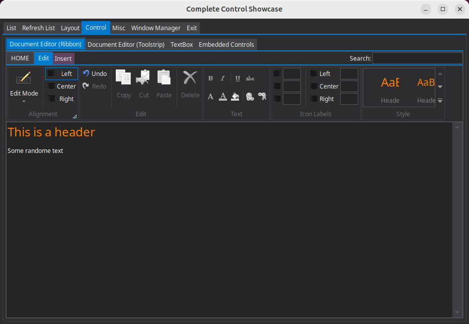

# wGac — Wayland Port of GacUI

[中文版](README_CN.md)

wGac implements the native GacUI platform layer for Linux Wayland using Wayland, Cairo, Pango, and XKBCommon.

## Prerequisites

The committed `Import/` and `Apps/` snapshots make a normal build independent of sibling source repositories. On Ubuntu, install the system build dependencies once with:

```bash
sudo ./build-prerequisites-ubuntu.sh
```

The script requires root privileges but never invokes `sudo` itself. It uses `apt-get` to update apt metadata and install the compiler, CMake, `pkg-config`, the required development packages, and the libdecor GTK runtime plugin. Review the script before running it if you need to audit system changes. On Debian or another Linux distribution, install the equivalent packages with that distribution's package manager.

The retained `WGacDialogService` implementation uses GIO, but current Wayland applications select `FakeDialogService`. Global shortcuts use GIO and require a desktop backend implementing the GlobalShortcuts portal; ordinary application dialogs do not require a portal.

`./build.sh` only configures and builds the project; it never downloads or installs dependencies. If CMake reports a missing compiler, `pkg-config`, or development module on Ubuntu, run `sudo ./build-prerequisites-ubuntu.sh` and then retry `./build.sh`.

Run applications from a Wayland desktop session with `WAYLAND_DISPLAY` and `XDG_RUNTIME_DIR` available.

wGac requires libdecor and a real runtime decoration plugin at startup; it stops with a diagnostic instead of silently accepting libdecor's undecorated fallback. To make repeated switches between GacUI custom frames and platform frames safe on every compositor, wGac forces libdecor to provide its client-side platform frame even when server-side decorations are available. This libdecor frame is the native platform frame from GacUI's perspective and is distinct from GacUI's custom window template.

For maintenance work, keep the GacUI, Workflow, and Tools repositories beside wGac, or run `./syncOrg.sh`. `import.sh` reads GacUI framework snapshots, and `syncProj.sh` reads GacUI test resources and builds the Workflow and GacUI generators. The sibling Release repository is not a build or import dependency.

## Supported Platforms

- Windows implementation is released in [the Release repo](https://github.com/vczh-libraries/Release)
- Linux implementation is released in [the wGac repo](https://github.com/vczh-libraries/wGac)
- macOS implementation is released in [the iGac repo](https://github.com/vczh-libraries/iGac)
- HTML5 implementation is released in [the GacJS repo](https://github.com/vczh-libraries/GacJS)



.png)

## Project Structure

```text
wGac/
├── WGac/                              Wayland platform implementation
│   ├── Protocol/                      Committed Wayland protocol sources
│   ├── Renderers/                     Cairo/Pango GacUI renderer
│   ├── Services/                      Native platform and automation services
│   └── Wayland/                       Display, seat, and buffer integration
├── WGacShared/                        GacUI, wGac, and shared test libraries
├── WGacTest/                          Hello World app and native service tests
├── WGacFullControlTest/               Full Control Test, standard or hosted
├── WGacTuiControlTest/                Terminal Control Showcase using TuiSkin
├── WGacCppTestRvm/                    Remote View Model Test client
├── RemotingTest_Rendering_Wayland/    Native renderer for RemotingTest_Core
├── Apps/                              Synchronized resources and generated C++
├── Import/                            Imported GacUI amalgamated sources
├── Import-Test/                       Test-only GacUI remoting helper amalgamations
├── import.sh                          Refresh Import from sibling GacUI
├── GacBuild.sh                        Run upstream generators with full metadata
├── syncProj.sh                        Refresh and generate Apps and shared sources
├── syncOrg.sh                         Synchronize organization repositories, including wGac
├── build-prerequisites-ubuntu.sh      Install Ubuntu system build dependencies
├── build.sh                           Build all test targets
├── test.sh                            Launch one native test target
└── test_core.sh                       Full-build and launch a sibling GacUI Core-side target
```

`Import/` and `Import-Test/` must not be edited directly; framework fixes belong in GacUI, and Wayland compatibility fixes belong in wGac. This is a development rule; the generated files and directories retain owner write permissions. `Import-Test/` contains the dedicated neutral `Test.RemotingHelpers` pair; the stdio transport implementation comes from the matching `VlppOS.Linux.cpp` in `Import/`. These files are for platform test targets and are not part of the ordinary GacUI framework snapshot. Files under `Apps/*/Resources/` and `Apps/*/Source/` are synchronized or generated by `./syncProj.sh` and must not be edited directly.

## Synchronizing Dependencies

Synchronize the organization repositories, including this wGac checkout:

```bash
./syncOrg.sh
```

Refresh the imported framework snapshot:

```bash
./import.sh
```

This replaces `Import/` and `Import-Test/`, copies the ordinary framework files from `../GacUI/Import/` and `../GacUI/Release/`, adds the DarkSkin and TuiSkin release sources, moves the neutral `Test.RemotingHelpers` pair into `Import-Test/`, and keeps both snapshots writable by their owner. The imported `VlppOS.Linux.cpp` supplies the stdio transport implementation.

Refresh the Terminal Control Showcase, Full Control Test, Remote Protocol Test, and Remote View Model Test projects:

```bash
./syncProj.sh
```

This incrementally builds `<Workflow repo>/Tools/CppMerge`, `<GacUI repo>/Tools/GacGen` and `<GacUI repo>/Tools/GacBuild` through their existing native build helpers. It copies all four upstream resource trees and their seed C++ files, then invokes `<wGac repo>/GacBuild.sh -mode:GacGen` for each resource. GacGen stages `/P32` and `/P64`; GacBuild validates both outputs and uses CppMerge to merge matching files into `<wGac repo>/Apps/*/Source/`. This preserves upstream seed `USER_CONTENT`, embedded resources and `RemoteViewModelTestRpc.h/.cpp`. Generated reflection files remain present and excluded from targets using `VCZH_DEBUG_NO_REFLECTION`.

`GacBuild.sh` locates all three executables in the sibling GacUI and Workflow repositories and supplies explicit absolute paths to GacGen and CppMerge. It passes a temporary GacGen symlink without resolving it, so the adjacent `Metadata.txt` selects full `Reflection32.bin` and `Reflection64.bin` from `<GacUI repo>/Test/Resources/Metadata/`. Full metadata includes generated dialog types absent from the development tool's usual core-only metadata. The wrapper removes its temporary entry point on success or failure and returns the native tool's exit status. Maintenance uses the sibling Workflow and GacUI repositories; it does not require a Release checkout.

After `syncProj.sh` builds the tools, the wrapper can also be used directly:

```bash
./GacBuild.sh -FileName path/to/GacUI.xml -Dump
./GacBuild.sh -mode:GacGen -FileName Apps/TuiControlTest/Resources/Resource.xml
```

The default GacBuild mode takes a driver XML for incremental resource discovery; `-Dump` only reports the plan. Put `-mode:GacGen` first to rebuild one resource, optionally with `-MappingFileName <mapping>`. XML and mapping paths remain relative to the caller's working directory, even when invoking the wrapper from elsewhere.

Inspect `<wGac repo>/Apps/*/Resources/GacBuild.log` and `<wGac repo>/Apps/*/Resources/Resource.xml.log/{x32,x64}/` for orchestration and compiler diagnostics, staged C++/RPC files, binary caches and `Deploy.xml` deployment lists. Staging artifacts are retained after success or failure and ignored by Git; the next synchronization replaces the copied resource trees. Generation, missing-artifact, merge and deployment failures stop synchronization with nonzero status.

The script also copies the shared TUI GuiMain from `<GacUI repo>/Test/GacUISrc/CppTest_Tui/Main.cpp` and refreshes the shared native-renderer and RVM entry points, the RVM initializer, and the shared FullControlTest palette handler. The RVM entry point's shared automation argument header is copied to the committed root `<wGac repo>/SharedArguments.h`, so a fresh clone can build without sibling sources or temporary files. The standalone showcase attaches that handler so palette changes refresh existing controls in both standard and hosted modes. MiniHTTP automation is part of the imported GacUI snapshot, while reusable remoting test helpers come from `<wGac repo>/Import-Test/`; neither is maintained as a local `<wGac repo>/WGacShared/Mini*.cpp` copy.

## Building

```bash
./build.sh
./build.sh --rebuild
```

The first command is incremental. `--rebuild` removes only the `build/` directory and performs a clean build. Dependency discovery remains in CMake; when an Ubuntu machine is missing the required system packages, run `sudo ./build-prerequisites-ubuntu.sh` once and retry the build.

CMake discards cached X11 header and library paths that no longer exist, such as paths into a deleted temporary sysroot, and searches again. The TUI clipboard requires `libx11-dev` and `libxfixes-dev`; install them through the prerequisite script if discovery fails.

The root CMake project uses C++23 and builds:

- `GacUI`, the imported GacUI framework.
- `WGac`, the Wayland platform layer.
- `WGacShared`, imported remoting test helpers shared by the test targets.
- `Test_HellWorld_Cpp`.
- `Test_FullControlTest`.
- `Test_CppTest_Rvm`.
- `WGacTui` and `Test_TuiControlTest`.
- `RemotingTest_Rendering_Wayland`.

Run the native service regressions after building:

```bash
./build/WGacTest/bin/Test_AsyncService /C
./build/WGacTest/bin/Test_ImageService /C
./build/WGacTest/bin/Test_GlobalShortcuts /C
```

These tests cover pending work during nested modal pumping and cancellation when a callback stops the service.
Image tests cover disabled grayscale rendering, all 256 alpha values, transparent compositing, cache reuse, and preservation of the original image. Disabled images use the same lightened grayscale conversion as Windows and macOS, with unchanged alpha. The converted surface is created on demand in an `INativeImageFrameCache` owned by the frame and shared by its renderers.
Global-shortcut tests use an isolated D-Bus session (`dbus-daemon`, installed by the prerequisite script) and a mock portal to cover application registration, early responses, modifier encoding, multiple shortcuts, activation on the UI thread, duplicate/invalid registrations, denial, cancellation and removal. They do not grant desktop permissions or replace live desktop verification.

## Running and Automation

```bash
./test.sh --app:tui
./test.sh --app:simple
./test.sh --app:simple --unblock
./test.sh --app:fct
./test.sh --app:fct --hosted
./test.sh --app:fct --hosted --unblock
./test.sh --app:rvmt
./test.sh --app:rvmt --unblock
./test.sh --app:renderer
./test.sh --app:renderer --port:8890
./test.sh --app:renderer --unblock
./test_core.sh --app:cpptest_rvm --protocol:minihttp --unblock
./test_core.sh --app:fct --protocol:minihttp
./test_core.sh --app:rpt --protocol:minihttp
./test_core.sh --app:rvmt --protocol:minihttp [--cli]
```

`--hosted` is valid only with `--app:fct`. `--port:<1-65535>` is valid only with `--app:renderer` and selects that renderer's automation listener; it does not change the `/MiniHttp` connection to Core on port 8888. The default renderer automation port is 8889. `--unblock` starts the selected executable in the background and prints its PID.

`test_core.sh` follows the same `--app:` and `--unblock` spelling and requires
`--protocol:minihttp`, the only portable transport. It calls GacUI's
`Test/Linux` build helper with `-f` before starting each used GacUI project.
For manual `cpptest_rvm` and `rvmt` modes it starts the requester/Core first,
waits one second, then full-builds and starts `RemotingTest_RvmHost`; an
unblocked manual run prints both PIDs. `--cli` is supported by `--app:rvmt`,
prebuilds the host, and lets Core auto-launch it over stdio. Portable
`Test_CppTest_Rvm` remains manual `/MiniHttp` only.

The normal applications expose MiniHTTP automation on port 8888:

- Hello World: `/Automation/Test_HellWorld_Cpp`
- Full Control Test: `/Automation/Test_FullControlTest`
- Remote View Model Test: `/Automation/CppTest_Rvm`

For example:

```bash
curl http://localhost:8888/Automation/Test_HellWorld_Cpp/Controls
curl -H 'Content-Type: application/json; charset=utf8' \
    --data '!Exit' \
    http://localhost:8888/Automation/Test_HellWorld_Cpp/IO
```

Use `GET .../Controls` to inspect the control tree and `POST .../IO` or `POST .../IO/<windowId>` to send an IO command. A successful command returns `Queued`.

Always stop background test processes when verification is complete.

`--app:rvmt` waits for the matching Workflow RPC host. Start the client first, then run:

```bash
../GacUI/Test/Linux/RemotingTest_RvmHost/Bin/RemotingTest_RvmHost /MiniHttp
```

## Terminal Control Showcase

`./test.sh --app:tui` runs the hosted GacUI showcase directly in the current terminal. It requires interactive stdin/stdout and runs in the foreground; `--unblock`, `--hosted`, and `--port` are rejected. It has no HTTP automation endpoint. Start at 120x40 cells, also test 80x25, and follow [the TUI SOP](../GacUI/.github/Jobs/DebugTuiControlTestSop.md). Current results are in [TestMatrix_Tui.md](TestMatrix_Tui.md).

`WGac/TUI` composes `TuiControllerBase` with the existing wGac font/cursor, key-name and image services. Timers use the VlppOS owner-thread pump, and all windows and dialogs render in terminal cells. No Wayland surface or libdecor window is created. Font metrics remain `TuiFont`, size 1. The terminal determines displayed fonts and colors.

The TUI clipboard uses X11 selections (`libx11-dev` and `libxfixes-dev` are build prerequisites). On a Wayland desktop, XWayland supplies the bridge to other desktop applications; keep `DISPLAY` available. Without an X display, clipboard objects remain process-local. External transfers use UTF-8 text; rich documents and images remain available within the application. XFixes ownership notifications update clipboard-dependent commands. The app must remain running while another client reads its selection. Incoming incremental selections are supported; outgoing text must fit the X server's maximum request size.

Normal Hide, Close and Stop actions restore terminal input and output modes; terminal-tab close is not the normal shutdown test.

The provider initializes `LC_CTYPE` from the environment before starting workers, so native file/image services can decode Unicode filenames. Use a UTF-8 locale. The existing POSIX locale service retains en-US date/number formatting; translated showcase labels and dialogs still follow the selected application locale.

### Terminal input limitations

Local **Ctrl+Alt+Super+Q** requires a terminal that reports Super independently of Alt. GNOME Terminal 3.52.0 / VTE 0.76.0 discards Super and sends the same bytes as Ctrl+Alt+Q. This remains true in GNOME Terminal 3.58.0 / VTE 0.84.0 on Ubuntu 26.04.1: compositor-generated input produces `1b 11` for both chords. This limitation occurs when the terminal encodes input: GNOME/Wayland delivers Super to the focused terminal, but the TUI process receives only its output bytes. Native Wayland rendering receives the modifier directly for its own focused window.

Use [Kitty](https://sw.kovidgoyal.net/kitty/) for the local Super shortcut. Install it alongside GNOME Terminal, open a Kitty window, and run the existing application from the `wGac` directory:

```bash
./test.sh --app:tui
```

VlppOS automatically enables Kitty's keyboard protocol and decodes Super; no application code changes, desktop upgrade or special keyboard-protocol configuration are required. The [Linux verification record](TestMatrix_Tui.md) confirms Ctrl+Alt+Super+Q with both Super keys in Kitty 0.32.2 under GNOME Wayland/XWayland.

Desktop shortcuts and the remaining terminal restrictions are independent of Kitty's local Super support:

- **Ctrl+Alt+Super+Shift+F8** is a global shortcut with no local-key fallback. It uses the desktop portal independently of the terminal's keyboard encoding, so it also works in GNOME Terminal after portal approval. See [Global shortcuts](#global-shortcuts) for desktop requirements.
- Standard SGR mouse reports have no Super bit, so mouse `osSuper` remains false. Legacy terminal Meta continues to map to Alt.
- The requested keyboard mode does not report standalone modifier keys, so pressing Alt alone cannot show access-key overlays. Mouse and arrow-key menu navigation remain available.

## Native Remote Renderer

Build and start `GacUI/Test/Linux/RemotingTest_Core` in `/MiniHttp` mode for either `/RPT` or `/FCT`, then run:

`./test_core.sh --app:rpt --protocol:minihttp` is the full-build launcher for
the `/RPT` form (substitute `fct` for `/FCT`). The existing `test.sh` continues
to launch the native renderer:

```bash
./test.sh --app:renderer
```

The core listens on port 8888. The Wayland renderer connects through `/MiniHttp` and, by default, exposes its DOM and renderer-side IO on port 8889 at:

```text
/Automation/RemotingTest_Rendering_Native
```

Renderer replacement can reuse port 8889 after the old renderer stops. For live takeover, keep the existing renderer on 8889 and start the new renderer with `--port:8890`, then use the same automation prefix on port 8890.

Follow [GacUI's native-renderer verification guide](../GacUI/.github/Jobs/DebugRemoteProtocolWithNativeRenderer.md) for the complete RPT/FCT, replacement, takeover, and cleanup workflow.

## Input Mapping

Native Wayland input uses the shared declarations from VlppOS. Mouse movement, initial hover,
buttons, double clicks and both wheel axes preserve Alt independently of Super.
Left/right brackets and shifted braces map to `KEY_LEFT_BRACKET` (`0xDB`) and
`KEY_RIGHT_BRACKET` (`0xDD`); key-name lookup uses `[` and `]`.

## Known Limitations

- Terminal input has separate modifier and shortcut limitations; see [Terminal input limitations](#terminal-input-limitations) for the Kitty setup and remaining restrictions.
- Native Dialogs:
  - The native FileChooser portal is implemented for open and save dialogs.
  - Message box not implemented.
  - Color picker not implemented.
  - Font picker not implemented.
  - These are limitations of `WGacDialogService`; the Wayland implementation currently always uses GacUI's `FakeDialogService`, so applications do not invoke any native dialog.
- Wayland does not allow clients to position normal top-level windows globally; placement requests are compositor-dependent.
- libdecor has no platform-frame window-icon API, so `IconVisible` is unsupported and always reports `false`.
- libdecor cannot independently hide the maximize control. Its maximize affordance follows `SizeBox` (the frame's resize capability); `MaximizedBox` retains its requested value but cannot override that platform limitation.

## Global shortcuts

wGac registers global shortcuts through the [GlobalShortcuts portal](https://flatpak.github.io/xdg-desktop-portal/docs/doc-org.freedesktop.portal.GlobalShortcuts.html). Native and hosted Full Control Test use **Ctrl+Shift+Alt+Super+Q**; the TUI showcase uses **Ctrl+Alt+Super+Shift+F8**. Native remote renderers forward portal activations to their Core. These shortcuts can work while another application has focus.

GNOME supports this portal starting with [GNOME 48](https://release.gnome.org/48/developers/#global-shortcuts), including GNOME 50 on Ubuntu 26.04 LTS. wGac detects the portal at runtime; it does not gate support on an Ubuntu version. A missing portal or an unsupported key returns `NotSupported`. User approval and the final desktop binding are asynchronous: a returned registration ID reserves the request, and activation starts only after approval. The desktop may change the requested chord. Cancelling or denying approval leaves that registration inactive.

`<wGac repo>/test.sh` creates a hidden desktop entry in the current user's XDG application directory and sets `WGAC_APPLICATION_ID` to `org.gaclib.wGac.<app>`. This supplies the identity required for terminal-launched test executables through the [Registry portal](https://flatpak.github.io/xdg-desktop-portal/docs/doc-org.freedesktop.host.portal.Registry.html). Each test app has separate consent. Other applications launched from a terminal should install their own matching desktop entry and set this variable; applications with a desktop or sandbox identity may rely on portal identification without it.

On the first registration, GNOME can show **Add Keyboard Shortcuts** outside GacUI. Approve the intended shortcut there, then test it while another window has focus. This desktop consent dialog is not part of `FakeDialogService` or the MiniHTTP control tree. Removing a shortcut cancels its pending portal request and closes its session; stopping the process releases all its sessions. GNOME 50 can leave the consent window visible after cancellation; dismiss that stale window with **Cancel**. If the portal restarts, restart the app to register again.

### Ubuntu 26.04 review

The review on Ubuntu 26.04.1 / GNOME Shell 50.1 identifies **one newly enabled feature: global shortcuts**, shared by the native, hosted, TUI and remote-renderer paths. Other documented restrictions remain:

| Feature | Ubuntu 26.04 result |
| --- | --- |
| Local Super shortcuts in GNOME Terminal | Still loses Super with VTE 0.84.0; use a compatible terminal such as Kitty. |
| SGR mouse Super / standalone Alt overlays | Unchanged terminal protocol and requested keyboard-mode restrictions. |
| Native message, color and font dialogs | Still not implemented in `WGacDialogService`; app dialogs continue using `FakeDialogService`. The existing FileChooser portal is not a new feature. |
| Global positioning of normal Wayland windows | Still compositor-controlled; newer drag protocols do not provide arbitrary positioning. |
| Platform-frame icon / independent maximize button | libdecor 0.2.5 still has no corresponding APIs. |
| TUI locale and external rich clipboard | Existing provider restrictions; the desktop upgrade does not implement these paths. |

The previously listed title-drag bug no longer reproduces: compositor-delivered dragging of the raw native renderer preserves the pointer's offset from the window corner. The compositor move path was already implemented in wGac commit `96ec017`; this is a corrected historical note, not an additional feature supplied by Ubuntu 26.04. See [the verification record](TestMatrix_Tui.md#ubuntu-2604-review-2026-10-09) for build and live test results.
